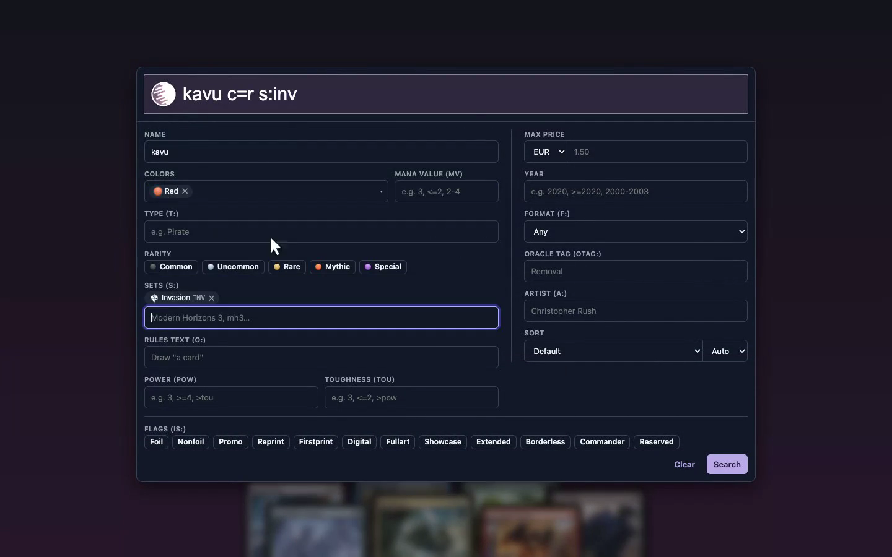

<p align="center">
  
</p>

<h1 align="center">Yassir – Query Builder for Scryfall</h1>

<p align="center">
  A browser extension for Chrome and Firefox that adds a query builder to the search box on <a href="https://scryfall.com">scryfall.com</a>.
</p>

Scryfall's search is powerful, but you have to know its syntax. Yassir adds a form to the search box: click the box, fill in the fields you care about, and the query is written for you.

The name stands for **Y**et **A**nother **S**cryfall **S**earch **I**nterface **R**efinement. In Arabic, yassir (يُسْر or يَسِير) means "easy", "simple" or "convenient".

[](docs/assets/yassir-scryfall-demo.gif)

Click the image to see Yassir in action.

## Features

- **A form for the common filters.** Name, rules text, type, colors, mana value, power, toughness, rarity, sets, format, max price, year, artist, oracle tag, flags such as foil or borderless, and sort order.
- **The query stays editable text.** Typing in the search box updates the form, and the form rewrites only its own terms.
- **Nothing is dropped.** Conditions the form has no field for appear as pins you can remove with a click.
- **Suggestions as you type.** Card and creature types, sets with their symbols, and color combinations by name (guilds, shards, wedges).
- **Search by what a card does.** [Scryfall Tagger](https://tagger.scryfall.com) is a community project that tags cards by their role, such as `removal`, `ramp` or `sweeper`. Few people know the tag names, so the oracle tag field lists them by group, each with a one-line description.
- **Ranges and comparisons.** Number fields take `3`, `<=2`, `2-4` or `>=2020`.
- **Private.** It runs only on scryfall.com and collects no data.

## Development

Requires Node.js 22 or newer.

```sh
npm install
npm run dev          # Chrome with live reload (dev:firefox for Firefox)
npm run build        # production build in dist/ (build:firefox, build:all)
npm run typecheck
npm test             # unit tests (Vitest)
npm run test:e2e     # smoke test on live scryfall.com
```

The e2e test loads `dist/chrome-mv3` into Playwright's Chromium, so run `npm run build` and `npx playwright install chromium` first. Set `HEADED=1` to watch it; screenshots go to `tests/e2e/.state/`.

## How it works

- The query text is the single source of truth. `src/lib/query-parse.ts` parses it, `readQuery` in `src/lib/query-sync.ts` turns it into form state, and `writeQuery` rewrites only the terms of the fields that changed.
- `src/lib/scryfall-syntax.ts` defines the form state and the terms each field writes. `src/lib/query-dictionary.ts` names the conditions shown as pins.
- The UI is Preact (`src/components`), mounted in a shadow root by `src/content/mount.ts`. The background worker (`src/background/sets.ts`) fetches the set list from the Scryfall API and caches it for a day.

## Contributing

- Keep `src/lib` free of DOM and browser APIs, and cover changes there with unit tests.
- `npm install` points git at `.githooks`, so `npm run check` (typecheck, lint, knip and unit tests) runs before every commit. `git commit --no-verify` skips it.
- Run `npm run test:e2e` when you change the UI.
- A few things about scryfall.com are easy to trip over:
  - Its CSP drops `style` attributes, so the shadow host is laid out by the `:host` rule in `src/ui/styles.css`. Styles set from script still work.
  - It binds single-letter keyboard shortcuts on the document, so the modal stops key events from leaving it.
## Credits

The oracle tag identifiers suggested in the `otag:` field (`src/lib/tag-suggestions.ts`) come from [Scryfall Tagger](https://tagger.scryfall.com), a community-maintained project for tagging Magic cards.

## License

[MIT](LICENSE).

Yassir is not affiliated with or endorsed by Scryfall.

Yassir is unofficial Fan Content permitted under the [Fan Content Policy](https://company.wizards.com/en/legal/fancontentpolicy). Not approved/endorsed by Wizards. Portions of the materials used are property of Wizards of the Coast. ©Wizards of the Coast LLC.
